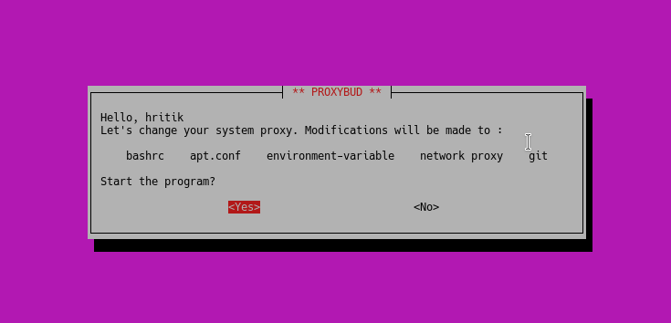

# ProxyBud
---
### Let's you configure proxy on Linux
#### How to use?
1. Download the zip by clicking [here](https://github.com/hritikgupta/ProxyBud/archive/master.zip).
2. Extract it and open the directory in terminal.
3. Enter the following command: `sh index.sh`

### Description :
Setting proxy on Linux can turn out be a very tedious task. The script adds proxy to bashrc, apt.conf, environment variable, network and git. 
The script run on system's default shell (only **Bash** supportive now).

#### What's New?
* A more interatctive and user friendly interface to configure proxy in Linux.
* Added option to differ proxy for HTTPS and FTP

 #### Found any issues?
 Report them [here](https://github.com/hritikgupta/ProxyBud/issues). I'll be glad to fix them.
 Contributions always invited! :) 
